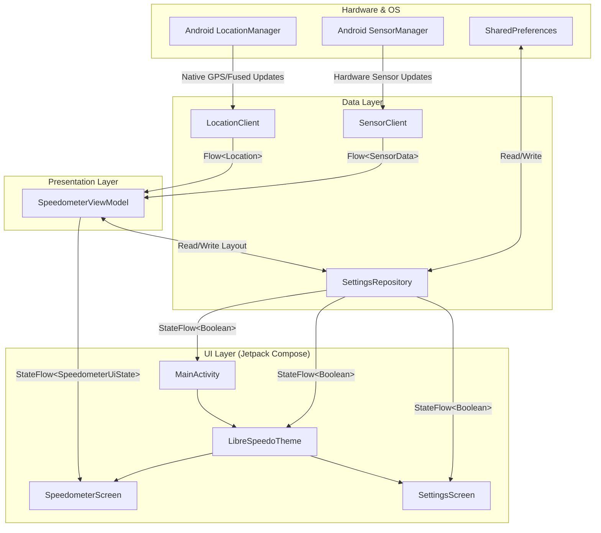

# LibreSpeedo Architecture

LibreSpeedo is built with modern Android development practices, emphasizing F-Droid compatibility (no proprietary Google Play Services), Kotlin Coroutines, and Jetpack Compose.

## App Architecture Diagram

## 1. Location Layer (Native Fused Provider)
To maintain the app's Libre status, we do not use the proprietary `FusedLocationProviderClient` from `com.google.android.gms`. Instead, `LocationClient` relies entirely on the native `android.location.LocationManager`.

### Provider Fallback Mechanism
When tracking begins, the `LocationClient` checks hardware capabilities and API levels to request the most accurate and battery-efficient provider:
1. **Native Fused Provider (`LocationManager.FUSED_PROVIDER`)**: Available on Android 12 (API 31) and above. It automatically fuses GPS, Wi-Fi, and sensors without Google Play Services.
2. **GPS Provider (`LocationManager.GPS_PROVIDER`)**: Fallback for devices below API 31 or if the fused provider is disabled. Relies purely on GNSS satellites.
3. **Network Provider (`LocationManager.NETWORK_PROVIDER`)**: Final fallback utilizing cell-towers and Wi-Fi networks if GPS is unavailable.

Location updates are wrapped and emitted as a continuous Kotlin `Flow<Location>`.

## 2. Sensor Layer (`SensorClient`)
To complement GPS data, `SensorClient` tracks hardware sensors including `TYPE_ACCELEROMETER`, `TYPE_GYROSCOPE`, and `TYPE_MAGNETIC_FIELD`.
* **Low-Pass Filter**: A software filter (`ALPHA = 0.15f`) is applied to raw accelerometer and magnetic field data to eliminate high-frequency noise and jitter.
* **Dynamic Tilt Compensation**: The app dynamically checks the dominant axis of gravity. If the device is held upright (e.g. in a car mount), it remaps the coordinate system using `SensorManager.remapCoordinateSystem()` so the compass calculation remains 100% accurate.

## 3. Presentation Layer
* **`SpeedometerViewModel`**: Subscribes to both the `LocationClient` and `SensorClient` Flows. It parses raw location metrics, exposes raw sensor data, and implements a **Smart Fused Bearing**: using GPS bearing when moving faster than 3 km/h, and falling back to the hardware compass azimuth when stationary or moving slowly. It also manages the state of the **Modular Dashboard**, persisting the active widget layout via `SettingsRepository`.
* **`SpeedometerScreen`**: A declarative Jetpack Compose UI built entirely around a responsive `LazyVerticalGrid`. It supports adaptive multi-column layouts for Landscape/Tablet modes and includes a custom 2D drag-and-drop gesture engine for rearranging widgets on the fly.

## 4. UI Theming & Branding
LibreSpeedo utilizes a custom Material 3 Dark Theme mapping:
* **TealPrimary (`#236077`)**: Used for primary accents.
* **AmberAccent (`#F29938`)**: High-visibility warning/accent color.
* **SlateBackground (`#1E2A35`)**: The core background tone designed to reduce glare at night.
* **SurfaceDark (`#2B3945`)**: Used for elevated cards and panels (assigned to `surface` and `surfaceVariant`).
* **TextWhite (`#F1F5F9`)**: Crisp typography color (`onSurface`, `onBackground`).

Dynamic coloring (Android 12+) is explicitly disabled (`dynamicColor = false`) to enforce this high-contrast brand aesthetic regardless of the user's system wallpaper.
